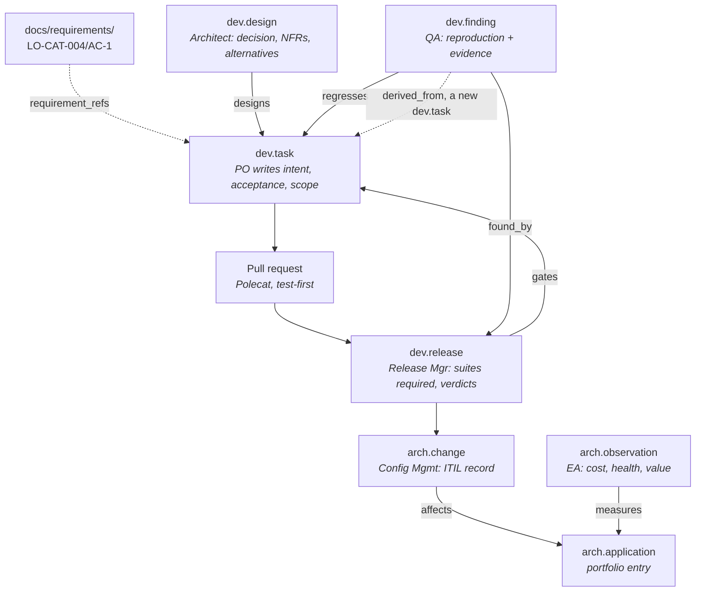

# The agentic SDLC as a bead graph

**Status:** ADOPTED
**Companion to:** [`agentic-operating-model.md`](agentic-operating-model.md), which defines the loops
and personas this document gives carriers to.

## The idea

Agents do not share context by talking to each other. They share it by writing typed, linked beads
that the next agent reads. A handoff is not a message — it is a bead, and the edge that connects it
to what came before.

This matters because the three loops never run at the same time. The Polecat that implements a task
has no access to the conversation where the architect decided the NFR. The reviewer three days later
has neither. If knowledge is not in a bead, it is in a transcript nobody will read, and it is
functionally lost.

## The primitives

The substrate is not missing primitives — the discipline is in *using* them.

**Types** ([`apps/substrate/src/schemas.py`](../../apps/substrate/src/schemas.py)): the `dev`
namespace holds artifacts passing through the SDLC, the `arch` namespace holds the service model and
the ITSM records that move it, and vertical namespaces (`finance` for the LifeOps example) hold
domain data. [`bead-object-inventory.md`](bead-object-inventory.md) is the canonical inventory of
which types are live.

**Edges** ([`apps/substrate/src/models.py`](../../apps/substrate/src/models.py)): `bead_link` is a
typed, directed edge table — `source_id`, `target_id`, `link_type` — with cascading foreign keys, a
uniqueness constraint on the triple, and no self-edges. `link_type` is validated against
`BEAD_LINK_TYPES`, the closed vocabulary.

Edges must never live inside `content` as string arrays. That dangles silently when a target is
deleted, and application-level encryption encrypts every leaf value in `content`, so such references
could never be queried. The table fixes both. **It is the knowledge graph.**

## The return path

`dev.task` carries work *forward*: intent, acceptance, scope, requirements, NFRs and architectural
impact.

Something must carry knowledge *back*. The return arrow in the operating model diagram — bugs, CMDB
deltas, portfolio metrics — needs its own carriers, or the outer loop broadcasts and the inner loops
absorb, and everything the inner loops learn dies with the session that learned it.

## Carriers, per persona

| Loop | Persona | Produces | Bead type |
|---|---|---|---|
| Outer | Product Owner | Work specification | `dev.task` |
| Outer | SRE | Operational observation | `dev.note`, `dev.finding` |
| Dev | Architect / SME | Design decision, alternatives rejected | `dev.design` |
| Dev | Polecat | Code, and a state transition on the task | PR + `transition` |
| Release | Release Manager | Gate run: suites required, verdicts, merge order | `dev.release` |
| Release | QA Engineer | Defect, with reproduction and evidence | `dev.finding` |
| Release | Config Management | ITIL change record against applications | `arch.change` |
| Release | Enterprise Architect | Portfolio and AI-engineering metrics | `arch.observation` |

The EA persona needs no dedicated type — `arch.observation` already carries measurements against
model objects, which is exactly what portfolio metrics are.

## Edge vocabulary

The canonical edge table — every admitted `link_type`, its source/target kinds and its writer, plus
what stays deliberately excluded — lives in
[`bead-object-inventory.md`](bead-object-inventory.md#edge-vocabulary). Directed, `source
--link_type--> target`, validated against `BEAD_LINK_TYPES` (`apps/substrate/src/schemas.py`).

## One unit of work, end to end

The dotted line from `dev.finding` back to `dev.task` is the loop closing: a defect becomes new
work, carrying its own lineage (`dev.task --derived_from--> dev.finding`), so the second attempt
knows what the first got wrong.

## What this makes answerable

The point is not tidiness. It is the queries that become possible once the edges exist and stop
being prose in a PR body:

- *Which requirement is this line of code serving?* — follow `requirement_refs` back from the task
- *What did we decide, and what did we reject?* — the `dev.design` bead, not a lost conversation
- *This broke. What change introduced it, and what was that change trying to do?* — `regresses`
  then `designs`
- *Which regression suites must this release run?* — the union of what its tasks touched, rather
  than an inference from the diff
- *Is the CMDB current?* — every `arch.change` traces to an application, and gaps are visible
- *Which model is producing value at what cost?* — `arch.observation` against portfolio entries

## Getting the graph to the gate

The release loop runs without a substrate credential, by design: a gate that reads live data is a
gate whose two runs of the same release can disagree because a bead moved underneath them.

Two ways to give it the graph, and the difference is not convenience:

**Live access.** Put `SUBSTRATE_API_KEY` in the gate's environment and let it query beads
directly. Simple, and it would let the gate write its findings back as beads without a human in
the middle. It also puts a production credential inside the gate's process, and makes every gate
run read whatever the graph happens to say at that moment.

**A release manifest.** Something that *does* hold the key — the dispatcher, or the outer loop —
exports the relevant subgraph to a file in the repository before the handoff. The gate reads it
like any other file.

The manifest is the better answer, for a reason beyond secret handling: **a gate must be
reproducible.** A manifest is a snapshot, committed alongside the release, so a disputed verdict
can be re-litigated against exactly the inputs that produced it. It is the audit record, not just
the delivery mechanism.

### What the manifest carries

Per PR in the release:

| Section | Content | Serves |
|---|---|---|
| Task | `dev.task` id, intent, acceptance, scope, `risk_class` | Release Manager |
| Requirement | `requirement_refs` resolved to their text from `docs/requirements/` | Release Manager, QA |
| Design | linked `dev.design` — the decision and what was rejected | Release Manager |
| NFRs | each `{category, statement, threshold, verification}` | **QA** |
| Architecture | `arch_impact` entries with portfolio disposition and health | **Config Mgmt, EA** |
| Edges | `designs`, `supersedes`, and any `regresses` from prior releases | QA |

The NFRs are the required test cases, stated rather than inferred. The edges are what has broken
here before.

The `regresses` edges are what make QA's flywheel real across releases: a task that has been the
target of a defect before arrives at the gate already carrying that history, so the reviewer knows
where to press without having to remember.

### The return path, mechanically

The gate does not write beads; its learning goes through review rather than into memory. Its output
is a verdict document; the outer loop converts findings into `dev.finding`, `arch.change` and
`arch.observation` beads, linking each back to the task it came from. That conversion is the SRE
persona's absorb step, and it is the one place a human sits between two loops.

## The full object inventory

This document covers the types the SDLC loops exchange.
[`bead-object-inventory.md`](bead-object-inventory.md) is the complete register — what is live, what
is missing, what is deliberately out of scope by CSDM stage, and the criteria for promoting
requirement references from strings to beads.

## What stays open

1. **`dev.spike` and `dev.evaluation`** have no carrier — see the inventory's gaps table. Without
   `dev.evaluation`, reviewer precision lives in a hand-maintained calibration file rather than a
   queryable metric.
2. **The absorb step is attended.** Converting a verdict's findings into beads is done by the outer
   loop, by hand, against the finding filer; nothing files them mechanically from the verdict.
